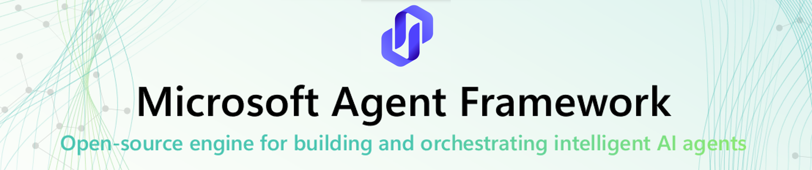

# Welcome to Microsoft Agent Framework for Go!

[](https://discord.gg/b5zjErwbQM)
[](https://learn.microsoft.com/en-us/agent-framework/)

Welcome to Microsoft's comprehensive multi-language framework for building, orchestrating, and deploying AI agents with support for .NET, Python and Go implementations.
This framework provides everything from simple chat agents to complex multi-agent workflows with graph-based orchestration.

This repository contains the source code for the the Go implementation of the Microsoft Agent Framework, along with samples and documentation to help you get started.
The .NET and Python implementations are available at https://github.com/microsoft/agent-framework.


<p align="center">
  <a href="https://www.youtube.com/watch?v=AAgdMhftj8w" title="Watch the full Agent Framework introduction (30 min)">
    
  </a>
</p>
<p align="center">
  <a href="https://www.youtube.com/watch?v=AAgdMhftj8w">
    Watch the full Agent Framework introduction (30 min)
  </a>
</p>

## 📋 Getting Started

### 📦 Installation

```bash
go get github.com/microsoft/agent-framework-go
```

### 📚 Documentation

- **[Overview](https://learn.microsoft.com/agent-framework/overview/agent-framework-overview)** - High level overview of the framework
- **[Quick Start](https://learn.microsoft.com/agent-framework/tutorials/quick-start)** - Get started with a simple agent
- **[Tutorials](https://learn.microsoft.com/agent-framework/tutorials/overview)** - Step by step tutorials
- **[User Guide](https://learn.microsoft.com/en-us/agent-framework/user-guide/overview)** - In-depth user guide for building agents and workflows

### ✨ **Highlights**

- **Graph-based Workflows**: Connect agents and deterministic functions using data flows with streaming, checkpointing, human-in-the-loop, and time-travel capabilities
  - [Python workflows](./python/samples/getting_started/workflows/) | [.NET workflows](./dotnet/samples/GettingStarted/Workflows/)
- **AF Labs**: Experimental packages for cutting-edge features including benchmarking, reinforcement learning, and research initiatives
  - [Labs directory](./python/packages/lab/)
- **DevUI**: Interactive developer UI for agent development, testing, and debugging workflows
  - [DevUI package](./python/packages/devui/)

<p align="center">
  <a href="https://www.youtube.com/watch?v=mOAaGY4WPvc">
    
  </a>
</p>
<p align="center">
  <a href="https://www.youtube.com/watch?v=mOAaGY4WPvc">
    See the DevUI in action (1 min)
  </a>
</p>

- **Multiple Agent Provider Support**: Support for various LLM providers with more being added continuously
  - [Examples](./samples/getting_started)

### 💬 **We want your feedback!**

- For bugs, please file a [GitHub issue](https://github.com/microsoft/agent-framework-go/issues).

## Quickstart

### Basic Agent

Create a simple Azure Chat Agent that writes a haiku about the Microsoft Agent Framework

```go
package main

import (
	"context"
	"fmt"

	"github.com/microsoft/agent-framework-go/agent/provider/openaichatagent"

	"github.com/Azure/azure-sdk-for-go/sdk/azidentity"
	"github.com/openai/openai-go/v3"
	"github.com/openai/openai-go/v3/azure"
)

func main() {
	// Authenticate to Azure.
	token, err := azidentity.NewDefaultAzureCredential(nil)
	if err != nil {
		panic(err)
	}

	// Create an Azure OpenAI agent.
	// Replace <endpoint> and <apiVersion> with your Azure Foundry endpoint and API version.
	a := openaichatagent.NewAgent(openaichatagent.Config{
		Client: openai.NewClient(
			azure.WithEndpoint("<endpoint>", "<apiVersion>"),
			azure.WithTokenCredential(token),
		),
		Model: "gpt-4o-mini",
	})

	// Run the agent.
	ctx := context.Background()
	fmt.Println(a.RunText(ctx, "Write a haiku about the Microsoft Agent Framework").Collect())
}
```

## More Examples & Samples

- [Getting Started with Agents](./examples/01-get-started): progressive tutorial from hello-world to hosting
- [Agent Concepts](./examples/02-agents): deep-dive samples by topic (tools, middleware, providers, etc.)
- [Getting Started with Workflows](./examples/03-workflows): workflow creation and integration with agents

## Contributor Resources

- [Contributing Guide](./CONTRIBUTING.md)

## Important Notes

If you use the Microsoft Agent Framework to build applications that operate with third-party servers or agents, you do so at your own risk. We recommend reviewing all data being shared with third-party servers or agents and being cognizant of third-party practices for retention and location of data. It is your responsibility to manage whether your data will flow outside of your organization's Azure compliance and geographic boundaries and any related implications.

Microsoft Agent Framework for Go is currently in Private Preview. While it is functional and can be used for development and testing, it may not yet be suitable for production use.
